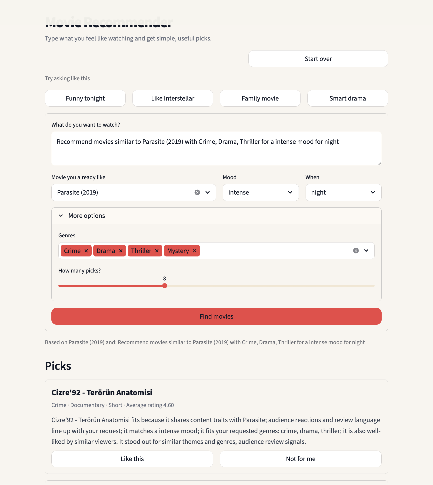
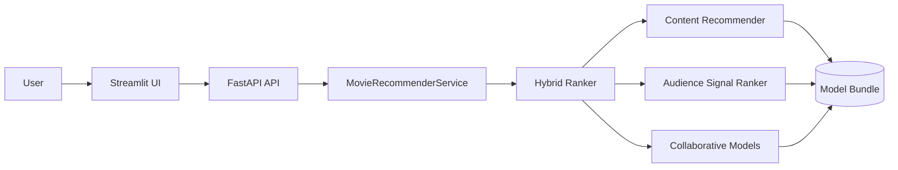
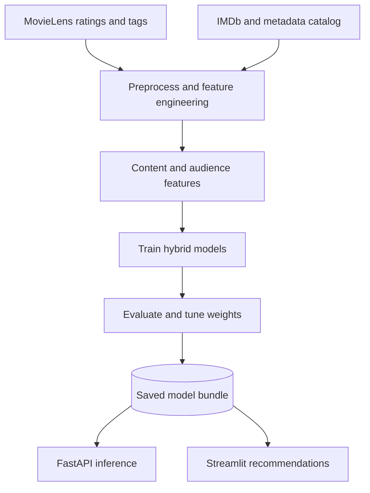

# Movie Recommendation System

A production-style movie recommender built with open movie datasets, hybrid ranking, a FastAPI backend, and a Streamlit interface. The system combines content similarity, collaborative filtering, audience-review signals, and lightweight natural-language query understanding so recommendations feel targeted instead of generic.



## Highlights

- Audience-aware hybrid ranking instead of genre-only matching
- Natural-language search with typed or selected movie seeds
- Content-based, collaborative, and neural recommenders in one pipeline
- FastAPI inference service plus Streamlit product UI
- Open-source LLM support through Ollama or Hugging Face Transformers
- MLflow-ready training and evaluation workflow

## Architecture

### Runtime Architecture



### Data and Training Pipeline



More detail lives in [docs/architecture.md](docs/architecture.md).

## Project Layout

```text
src/movie_recommender/
  api/            FastAPI schemas and app wiring
  cli/            Training and serving commands
  config/         Project settings
  data/           Downloading, catalog prep, preprocessing
  features/       Vectorization and content feature stores
  llm/            Query parsing and explanation backends
  models/         Matrix factorization and autoencoder models
  ranking/        Audience-aware ranking logic
  recommenders/   Content, popularity, SVD, and hybrid ranking
  services/       Training, evaluation, inference orchestration
apps/             Streamlit application
api/              API entrypoint
tests/            Regression and integration tests
docs/             Deployment notes, architecture, and assets
```

## Quick Start

1. Create a virtual environment and install dependencies:

```console
$ python3 -m venv .venv
$ source .venv/bin/activate
$ pip install -e ".[dev]"
```

2. Prepare a free movie catalog and optional metadata:

```console
$ movie-recommender prepare-data --dataset starter
```

This expands the recommendation catalog with a broader external movie list by default. For a lighter local setup, add `--catalog-source none`.

3. Train the models and save the bundle:

```console
$ movie-recommender train --dataset starter
```

4. Evaluate the bundle:

```console
$ movie-recommender evaluate
```

5. Run the API:

```console
$ movie-recommender serve-api
```

6. Run the Streamlit app:

```console
$ movie-recommender serve-ui
```

## Free Catalog Options

The downloader supports these built-in free presets:

- `starter`: quickest local iteration and testing
- `expanded`: larger catalog for broader experiments
- `benchmark`: larger benchmark-scale training
- `classic`: compact classic benchmark

You can also pass a direct HTTPS zip URL or a local `.zip` catalog path with `--dataset`.

## Large Catalog Mode

The app keeps interaction data for personalization, then expands the title catalog with a broader external source so you can search and recommend far more movies than the starter interaction set alone.

Defaults:

- catalog source: `imdb`
- catalog limit: `250000`
- minimum votes: `25`

Use a lighter setup:

```console
$ movie-recommender prepare-data --dataset starter --catalog-source none
```

Use a broader setup:

```console
$ movie-recommender prepare-data --dataset starter --catalog-source imdb --catalog-limit 0
```

## Natural Language Support

The system supports two open-source LLM adapters:

- `ollama`: connects to a local Ollama server and can use models like `llama3`
- `transformers`: loads a local Hugging Face model such as `google/flan-t5-small`

Both backends are optional. If neither is available, the system falls back to deterministic query parsing and template-based explanations.

## Download Notes

The dataset downloader uses streamed HTTPS downloads and automatically falls back to `curl` when Python SSL verification fails on local proxy or custom-certificate setups.

If your machine uses a custom root certificate, run:

```console
$ movie-recommender prepare-data --ca-bundle /path/to/certificate.pem
```

You can also set:

```console
$ export MOVIE_RECOMMENDER_CA_BUNDLE=/path/to/certificate.pem
```

As a last resort on a trusted network:

```console
$ movie-recommender prepare-data --insecure-download
```

If you prefer to download the archive yourself in a browser or with another tool:

```console
$ movie-recommender prepare-data --dataset ~/Downloads/starter.zip
```

## Documentation

- [docs/architecture.md](docs/architecture.md)
- [docs/deployment.md](docs/deployment.md)
