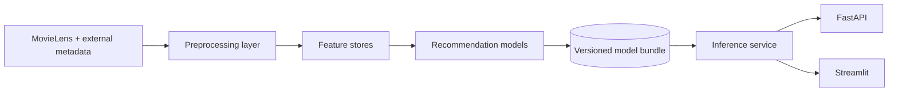
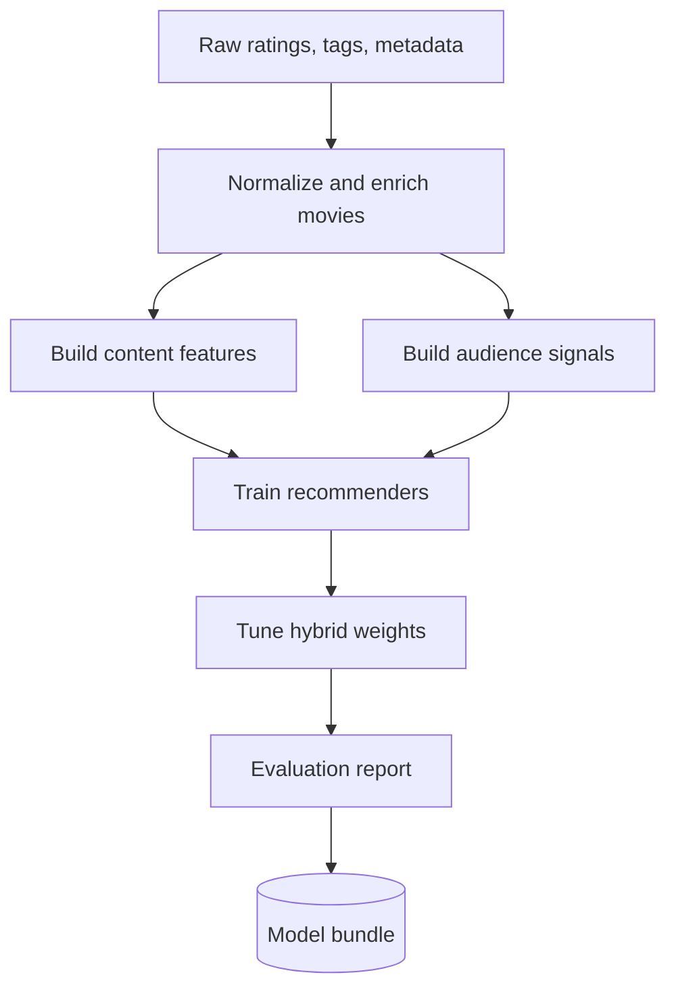
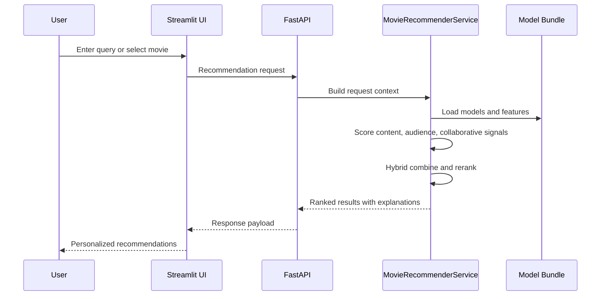

# Architecture

This project is organized as a hybrid recommendation platform with separate layers for data preparation, feature generation, ranking, model training, inference, and product delivery.

## High-Level Design

## Core Components

- `data/`: downloads datasets, normalizes ratings and tags, merges external catalog metadata, and prepares model-ready tables
- `features/`: builds TF-IDF and optional semantic representations for content retrieval
- `ranking/`: adds audience-consensus, audience-language, and query-alignment style signals
- `recommenders/`: contains content, popularity, collaborative, and hybrid ranking logic
- `models/`: trains matrix factorization and autoencoder recommenders
- `services/`: orchestrates training, evaluation, bundle loading, and online inference
- `api/` and `apps/`: expose the recommender through FastAPI and Streamlit

## Training Flow

## Online Recommendation Flow

## Why This Structure Works

- It keeps offline training concerns separate from the online serving path.
- It allows richer ranking signals, including audience-review language, without coupling everything to one model.
- It supports UI, API, and CLI workflows from the same bundle and service layer.
- It makes the repository easier to explain in interviews, demos, and GitHub documentation.
